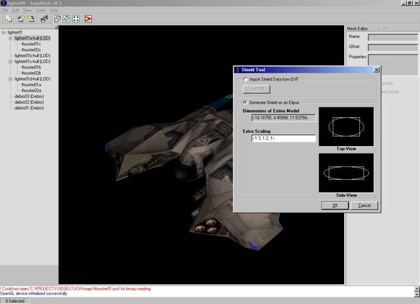

# Segeltuch

Segeltuch is a 3-dimensional, hierarchy based modeler dedicated to the creation of models
for the game FreeSpace 2 by Volition, Inc.

From the original description:

> It has been under development for some time now due to the relaxed priority that I have given it.  Though I may work on it less from time to time, coding has not and will not ever stop.  The code-base that I am developing with each new version of this application is important for future applications.  This means that Segeltuch will probably be the first in line of many gaming editors.  But let us not get too far ahead of ourselves.  The first public release of Segeltuch took place on Oct. 5, 2000.  We'll see what kind of future it has.

Well, it was ambitious but unfortunately my schooling got in the way and the app was never further developed.

I am releasing it to github since FreeSpace is now open source and some may find this stuff useful.